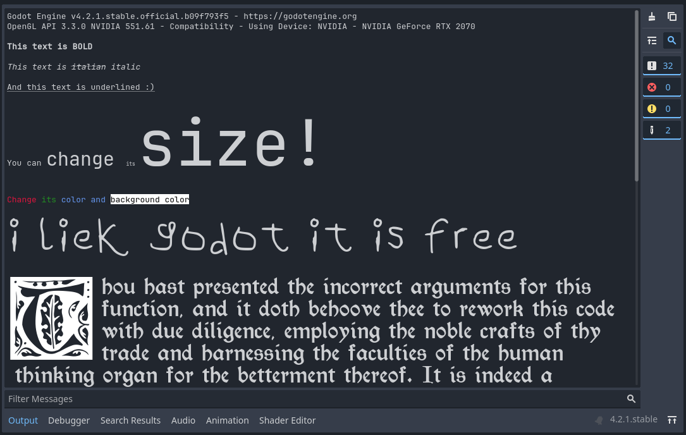

# GodotPrintRichExamples
### Examples of how you can use print_rich() in Godot

This is the project I used to show off the usecases of print_rich() in my [Youtube video about this topic](https://www.youtube.com/watch?v=NSaczr74LzU).

## Animated image creator

I've included a script that lets you generate an AnimatedTexture resource from all the images in a selected folder.

Put this script on a node (already present in main.tscn), set the properties in the inspector and hit generate. Then you can view and save the output from the inspector using the dropdown menu on the output resource.

You can use sites like [ezgif.com](https://ezgif.com/) to extract all the frames from a gif

## Fonts used

Little Kids Handwriting by Cloudy's Fonts
> The font used is Little Kids Handwriting. All rights are reserved by Cloudy's Fonts. Avalaible at dafont.com
https://www.dafont.com/little-kids-handwriting.font

Gothic Leaf by Flight of the Dragon
https://www.dafont.com/gothic-leaf.font 

MB Think Twice by Irina ModBlackmoon 
https://www.dafont.com/mb-think-twice.font 

Morris Roman by Dieter Steffmann 
https://www.dafont.com/morris-roman.font 